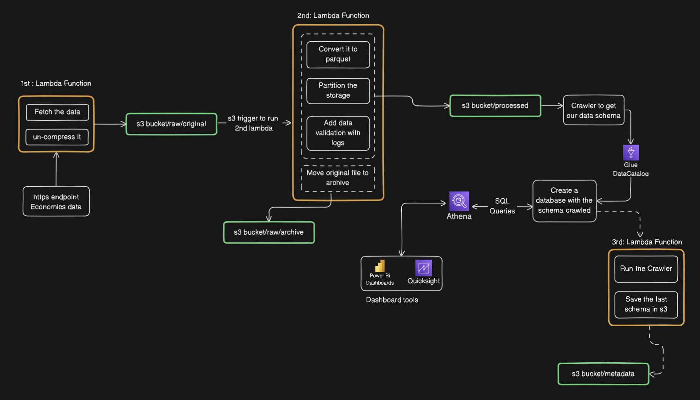

# iata-data-pipeline

Description of the case study :

The dataset is available at: https://eforexcel.com/wp/wp-content/uploads/2020/09/2m-Sales-Records.zip

The solution should consist of a set of AWS Lambda functions that:
- Fetch the ZIP file from the HTTPS endpoint ;
- Uncompress the file ;
- Convert the data to Parquet format ;
- Partition the Parquet data by the Country field and store it in S3 ;
- The original CSV file should be archived under a different prefix within the same S3 bucket ;
- The final Parquet data must be queryable through Athena ;
- The entire solution should be deployable using an IaC (here CloudFormation).

The overall logic and architecture decided for this case will be as follows :

 

Below is the breakdown of the logic and components of this above diagram:

1. Data Ingestion (Fetch + Uncompress)
    * A first Lambda function fetches a ZIP file from an HTTPS endpoint.
    * It uncompresses the ZIP and extracts the CSV.
    * The extracted CSV is stored in s3://iata-pipeline-data/raw/original/

2. Data Transformation (Convert + Partition + Archived)
    * A second Lambda function is automatically triggered when the CSV lands in s3://iata-pipeline-data/raw/original
    * Converts the CSV into Parquet format.
    * Partitions the data based on the Country column.
    * Stores the output in s3://iata-pipeline-data/processed/
    * The original CSV file is moved to an archive folder: s3://iata-pipeline-data/raw/archive/.

3. Schema Registration & Athena querying
    * A Glue Crawler scans the processed folder and extracts the data schema.
    * The schema is saved in the AWS Glue Data Catalog.
    * A Glue Database is created from this schema.

4. Metadata Update
    * A crawler is automatically run when new data is processed and saved in s3://iata-pipeline-data/processed/
    * The json schema is stored in s3://iata-pipeline-data/metadata/

    - The structured data can now be queried with SQL using Amazon Athena.

Improvements:

I also would like to :
* Run data validation checks in step 3 and log them in a dedicated CloudWatch log group for the entire project.
* If the project evolves and data ingestion becomes more frequent, we could consider introducing an Iceberg layer. For now on it's overkilled.
* Align with IATA naming conventions for S3 buckets, including account ID, region, or any specific internal rules.

**Repo Explanation**

- cloudformation :
    Contains Infrastructure as Code (IaC) templates to deploy all required AWS resources.

- lambdas:
    Contains the Lambda function source code:
    * fetch_handler.py – handles Step 1: fetching and uncompressing the file.
    * process_handler.py – handles Step 2: converting to Parquet, partitioning, and archiving.
    * metadata_handler.py – handles Step 4: Running Crawler with s3 trigger and saving only schema.

- assets:
    Contains utility files such as images, architecture diagrams, and other documentation assets.

The final s3 structure : [s3 structure](assets/s3_structure.png) 